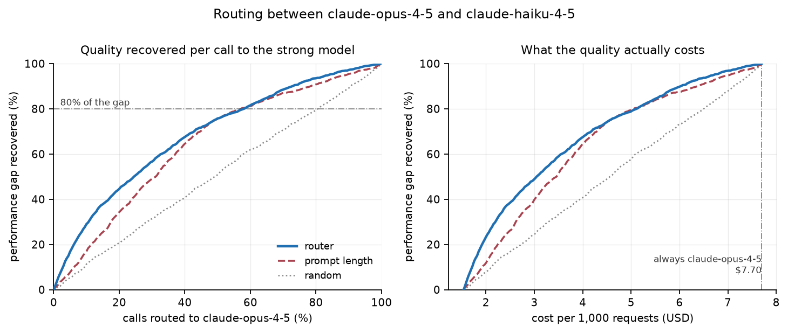

# Routers That Learn the Traffic Mix: Diagnosing Prompt-Only LLM Routing

**Brian Feeny**

*Draft, 21 September 2026. Independent work. The author is employed by Amazon Web
Services; the views and assessments here are his own.*

---

## Abstract

Learned LLM routers promise to send each request to the cheapest model that can
answer it, deciding from the prompt alone before any model is called. We
reproduce this setting on Amazon Bedrock, using the RouteLLM formulation and an
AgentCore Gateway request interceptor as the deployment point. Our labels come
from a cheapest-sufficient-tier cascade (Claude Haiku 4.5 → Sonnet 4.6 → Opus
4.5) over 7,222 unique exact-graded items. Every prompt-only router we trained posts a
strong in-distribution AUC (up to 0.865). Almost all of it is recognition of
which group a prompt came from. A within-group label shuffle keeps 99.5% of the
AUC on BBH (0.838 vs 0.842). A paired cluster bootstrap cannot separate any
router from a group-base-rate oracle on any of three datasets. Under
leave-one-group-out evaluation, both a linear probe on frozen embeddings
(equivalent to RouteLLM's matrix-factorisation router for a fixed pair) and a
fine-tuned encoder fall to 0.52–0.60. Similarity-weighted ranking scores below
chance even in-distribution. The shortfall is not a measurement artefact. The labels
are reproducible (per-tier test–retest κ = 0.88–0.97) and support an AUC
ceiling of 0.912. The frozen embedding does encode human-assigned difficulty
(probe AUC 0.57–0.78 within subject). We apply the same diagnostic to
RouteLLM's own MT-Bench evaluation set. There, category identity alone reaches
AUC 0.693 on the published labels. Finally, a deferral rule that escalates on
the cheap model's own output length, at no extra inference cost, reaches 0.752
under leave-one-group-out on MATH, where prompt-only routing reaches 0.600. We
release the diagnostic suite and argue that routing evaluations should report
group-held-out results as standard.

---

## 1. Introduction

Serving every request with the strongest available model is simple and
expensive. On Amazon Bedrock the price ratio between Claude Opus 4.5 and Claude
Haiku 4.5 is roughly five to one per token. Yet most production traffic does not
need the stronger model. A *router* decides per request, and a *prompt-only*
router decides before spending anything. It reads the prompt, predicts whether
the cheap model will suffice, and dispatches accordingly. RouteLLM [1] trained
such routers on preference data and reported large cost reductions at small
quality loss on MT-Bench.

We set out to reproduce that result on AWS, with the router in the request path
of a managed gateway rather than in client code. The gateway plumbing worked.
The result did not reproduce, and working out why became the paper.

Our central claim concerns what prompt-only routers learn, not whether routing
is possible:

> On every dataset we tested, including the MT-Bench set on which the original
> gains are reported, the in-distribution performance of prompt-only routers is
> predominantly explained by recognising which group (benchmark, task, subject,
> or category) a prompt belongs to, and recalling that group's escalation rate.
> This is a legitimate router for a fixed traffic mix and a useless one under
> drift. Standard item-level evaluation cannot tell the two apart.

We support the claim with an elimination argument. We rule out, in turn:
insufficient labels, router architecture, representational capacity, label
noise, and a frozen encoder. What remains is the task formulation itself. We then
show that a different formulation works where this one does not. That
formulation is deferral on the cheap model's own response.

**Contributions.**

1. A diagnostic suite for routing evaluations: within-group label shuffle,
   leave-one-group-out, and a paired cluster bootstrap against a group-rate
   oracle. We also note where the shuffle becomes unreliable (§3.2).
2. An elimination study showing that the gap between achievable (0.912) and
   achieved (~0.55) cross-group performance is not explained by label count,
   architecture, representation, label noise, or encoder fine-tuning (§4).
3. A label-stability measurement for cascade labels. Reliable per-call grading
   composes into a substantially less reliable ordinal label (§3.3).
4. Application of the diagnostic to RouteLLM's published MT-Bench evaluation
   set (§5).
5. A zero-cost deferral baseline that survives group-held-out evaluation where
   prompt-only routing does not (§6).
6. Two data-quality findings: a tier-correlated grading bias that manufactures
   escalation, and 1,313 identical-response battles in a widely used public
   routing dataset (Appendix A).

---

## 2. Setup

### 2.1 Deployment

Requests enter an Amazon Bedrock AgentCore Gateway addressed to a virtual model
ID. A REQUEST interceptor (AWS Lambda) decodes the body, computes a routing
decision, and rewrites the `model` field to a concrete target-qualified ID
before the gateway resolves routing. The client never names a real model. Every
decision is emitted as a CloudWatch embedded-metric record carrying the score,
the decision, the interceptor latency, and the prompt length. The prompt-only
router ships as JSON weights and scores with one Amazon Titan Text Embeddings V2
call plus a 256-term dot product, about 110 ms end to end. The stack is plain
CloudFormation plus a Makefile and deploys and tears down with one command.

### 2.2 Labels

**Cascade labels.** For each item we query Claude Haiku 4.5, Sonnet 4.6 and
Opus 4.5 in order at temperature 0. We stop at the first tier whose answer
grades exactly correct. The item's label is that tier's index $t \in \{0,1,2\}$,
or $t=3$ if no tier answers. For binary routing we use

$$
y = \mathbb{1}[\,t \in \{1, 2\}\,],
$$

meaning *escalating above the cheap tier changes the outcome*. Items that no tier
answers are negatives, because paying for Opus when Opus also fails is not a
win. We report the alternative coding $y = \mathbb{1}[t \ge 1]$ where it
matters.

| dataset | items | groups | $P(y=1)$ | Haiku / Sonnet / Opus / none |
|---|---|---|---|---|
| Mixed (GSM8K, MMLU, MMLU-Pro, BBH, MATH L4–5) | 2,709 | 5 benchmarks | 12.2% | 82.3 / 8.7 / 3.5 / 5.5 |
| BBH, all 27 tasks | 2,430 | 27 tasks | 27.7% | 67.6 / 14.2 / 13.5 / 4.7 |
| MATH, levels 1–5 | 2,520 | 7 subjects | 7.8% | 87.4 / 6.0 / 1.7 / 4.8 |

On MATH, escalation rises with human-assigned difficulty level: 2.7%, 2.4%,
5.6%, 6.8% and 16.0% for levels 1–5, flat across the first two and steep at
the top.

**Preference labels.** We also use RouteLLM's released `gpt4_judge_battles`
(109,101 battles) and `mmlu_battles` (1,531). All are for the single pair
GPT-4-1106-preview vs Mixtral-8x7B-Instruct, binarised as *GPT-4 won outright*
(9.4% positive).

### 2.3 Routers

| arm | description |
|---|---|
| Linear probe | Titan V2 embedding (256-d) → L2 logistic regression |
| SW ranking | RouteLLM's similarity-weighted ranking, reimplemented on Titan features |
| Fine-tuned encoder | `bge-small-en-v1.5` fine-tuned end to end, class-weighted |
| Prompt length | $\lvert \text{prompt} \rvert$ in characters (the AgentCore interceptor documentation's example rule) |
| Group oracle | training-set escalation rate of the item's group |
| Deferral | features of the cheap model's response (§6) |

**On matrix factorisation.** For a fixed model pair, RouteLLM's MF router is
already covered by the linear probe. MF scores a prompt embedding $e_q$ against
learned model vectors $v_s, v_w$ as

$$
P(\text{strong wins} \mid q) = \sigma\!\left((v_s - v_w)^{\top} \operatorname{diag}(w_2)\,(W_1 e_q + b)\right),
$$

which is linear in $e_q$. With two models, the low-rank structure adds nothing,
so the linear probe on Titan features *is* the MF router on different
embeddings. **On SW ranking.** The released implementation refits a weighted
Bradley–Terry MLE over the full battle set for every request. For a single pair
the MLE has a closed form, the similarity-weighted empirical win rate, so we
implement that exactly. The per-request refit makes the general case
unsuitable as an inline gateway interceptor.

### 2.4 Metrics

We report AUC with 2,000-sample percentile bootstrap intervals. For operating
points we follow RouteLLM. At strong-model call rate $c$, the performance gap
recovered is

$$
\mathrm{PGR}(c) = \frac{P(c) - P_{\text{weak}}}{P_{\text{strong}} - P_{\text{weak}}},
\qquad
\mathrm{APGR} = \int_0^1 \mathrm{PGR}(c)\,dc .
$$

For a binary *weak-sufficed* label, $\mathrm{PGR}(c)$ equals recall of the
positive class among the top-$c$ scored items. The curve is therefore a recall
curve drawn on a cost axis. We price with Bedrock on-demand list prices.

---

## 3. What prompt-only routers learn

### 3.1 Scale and the free baseline

Trained on 8,000 raw Chatbot Arena battles, the linear probe reaches a held-out
AUC of 0.525. Prompt length alone reaches 0.530. On RouteLLM's 110,632 labels the
probe reaches **0.706** on a 16,595-item hold-out, so label count was the first
constraint. On that same hold-out, prompt length reaches **0.660**, and the gap
is narrow: APGR 0.687 against 0.645 (random 0.506). At the operating point that
recovers 80% of the quality gap, prompt length needs slightly *fewer*
strong-model calls than the router (57.5% vs 58.0%). The router's advantage is
confined to aggressive savings. It recovers half the gap with 24.5% of calls,
where length needs 31.5%.

*Figure 1. Quality recovered against strong-model call rate (left) and cost per
1,000 requests (right), priced as Haiku → Opus. The learned router and prompt
length cross near 57% of calls.*

### 3.2 The diagnostic suite

In-distribution AUC on the cascade labels looks healthy. It is 0.744 on the
mixed set, 0.842 on BBH and 0.865 with a fine-tuned encoder. Three checks take
it apart.

**Within-group label shuffle.** Permute labels inside each group. This keeps
every group's base rate and destroys all within-group signal. Retrain on the
shuffled labels and score against the true ones. Whatever AUC survives came from
group recognition.

**Leave-one-group-out (LOGO).** Train on all groups but one and score the held-out
group. The unit of analysis is the group, not the item. A single random
held-out split is one draw from a wide distribution. On BBH our first seven-task
split gave the router 0.512 and prompt length 0.656. Across all eligible tasks
the means are 0.525 and 0.474, which reverses the ordering.

**Paired cluster bootstrap.** Resample groups rather than items. On each resample,
compare the router against the group-rate oracle.

| | real AUC | shuffled | retained | LOGO router | LOGO length | router − oracle (95% CI) |
|---|---|---|---|---|---|---|
| BBH (27 tasks) | 0.842 | 0.838 | **99.5%** | 0.525 | 0.474 | −0.021 [−0.055, +0.008] |
| Mixed (5 benchmarks) | 0.744 | 0.643 | 86% | 0.558 | 0.596 | +0.025 [−0.046, +0.123] |
| MATH (7 subjects) | 0.674 | 0.626 | 93% | 0.600 | 0.679 | +0.031 [−0.064, +0.142] |

*Table 1. Linear probe on Titan features. Every bootstrap interval spans zero.
No router is distinguishable from knowing the group base rate.*

On BBH the result is unambiguous. Escalation rates across tasks run from 0%
(`object_counting`) to 83% (`tracking_shuffled_objects_three_objects`), and the
templates make each task trivially identifiable.

**When the shuffle misleads.** The shuffle is weak at low positive rates when a
feature correlates with group. On MATH (7.8% positive), permuting within group
changes only 338 of 2,520 labels. The deferral features correlate with subject,
so a model fitted to shuffled labels still recovers 0.840 of a real 0.846. LOGO
shows the opposite conclusion (§6). When the two disagree at low base rates,
LOGO is the diagnostic to trust.

### 3.3 Are the labels good enough to learn from?

A failure to generalise could simply mean the target is noise. We resampled 181
items, stratified across every (benchmark, tier) cell. For each item we drew
four replicates per tier at temperature 0 and four at temperature 1, for 4,344
calls.

| tier | T=0 agreement | Cohen's κ |
|---|---|---|
| Haiku 4.5 | 98.9% | 0.973 |
| Sonnet 4.6 | 95.0% | 0.897 |
| Opus 4.5 | 95.0% | 0.878 |

Per-call grading is highly reproducible. The *composed* label is less so.
Rebuilding $t$ from each replicate independently, 17.1% of items change tier and
12.2% flip the binary label at temperature 0. At temperature 1 the figures are
41.4% and 29.8%. Three reliable binary decisions compose into a noticeably less
reliable ordinal one, and the instability lands on boundary items, which are the
ones a router must rank.

The quantity that matters is the ceiling. Scoring the soft label
$\hat p(\text{escalate})$ from the temperature-1 replicates against a
single-draw binary label gives **AUC 0.912 [0.863, 0.956]**. No predictor can
exceed this against our labels. Cross-group performance sits near 0.55, so the
labels leave a lot of learnable signal on the table. (The stability sample is
stratified to 46% positive, so the ceiling is an estimate for a balanced mix.)

---

## 4. Elimination

| explanation | test | result | verdict |
|---|---|---|---|
| Too few labels | 8k → 110k preference labels | 0.525 → 0.706 | fixed; did not transfer |
| Wrong architecture | SW ranking; MF | 0.460 on BBH (length 0.551); MF ≡ linear probe | eliminated |
| Representation lacks difficulty | probe *level ≥ 4* within MATH subject | 0.565–0.778 (mean ≈ 0.69) | eliminated |
| Labels too noisy | test–retest, ceiling | κ 0.88–0.97; ceiling 0.912 | eliminated |
| Frozen encoder | fine-tune `bge-small` | LOGO 0.547 (5 folds) vs 0.525 frozen | eliminated |

*Table 2. Each row is a candidate explanation for the cross-group gap.*

Two rows deserve comment. The representational probe shows the frozen Titan
embedding carries human-assigned difficulty about as well as it carries
anything. The information exists in the features, and the routers do not use it
to predict escalation. The fine-tuned encoder improves both in-distribution
(0.842 → 0.865) and LOGO (0.525 → 0.547) by about 0.02, well inside the
fold-to-fold standard deviation of 0.085. Its one strong fold,
`disambiguation_qa` at 0.704, is also the fold where prompt length is weakest.

Transfer across model pairs fails as well. The router trained on the 110k
GPT-4/Mixtral labels scores 0.567 on the mixed cascade set, below prompt length
(0.592). On BBH it scores **0.434 [0.408, 0.457]**, significantly below chance,
so it actively misroutes. This is consistent with RouteLLM's own report that
routers trained without in-distribution augmentation perform at chance on MMLU.

What survives elimination is the formulation. The labels are learnable to 0.912,
yet no prompt-only model we built reaches past ~0.60 on a group it has not seen.
From the prompt alone, the models learn *where a request came from* rather than
*whether the cheap model will get it right*.

---

## 5. The diagnostic on RouteLLM's MT-Bench set

MT-Bench is where RouteLLM reports its headline gains. It is stratified by
construction: 80 questions in 8 categories, two turns each. Using the published
questions and GPT-4 judgements, we label each (question, turn)
*strong-needed* when the judge scored GPT-4-1106-preview above Mixtral-8x7B.

| category | strong-needed | | category | strong-needed |
|---|---|---|---|---|
| coding | 65.0% | | stem | 25.0% |
| math | 45.0% | | writing | 25.0% |
| extraction | 40.0% | | roleplay | 20.0% |
| reasoning | 35.0% | | humanities | 10.0% |

Across categories the base rate spans 55 points. **Category identity alone
reaches AUC 0.693 [0.612, 0.781]** on the published label. A router fitted to
MT-Bench and evaluated one held-out category at a time averages 0.522 over seven
folds.

We did not re-run RouteLLM's released routers, because their checkpoints
consume OpenAI `text-embedding-3-small` features. We therefore do not claim
their gains are spurious. We claim only that a predictor knowing nothing about
difficulty reaches 0.693 on this set. Separating difficulty modelling from
category recognition requires a category-held-out evaluation, which the
original evaluation does not report and which the published data make cheap to
run.

---

## 6. A formulation that works: deferral

Prompt-only routing asks a hard question: will the cheap model succeed on this
request? Deferral asks an easier one: does the answer the cheap model has
already produced look like a failure? It needs no extra inference. At the
moment the weak response returns, the gateway already holds everything
required.

We use features of Haiku's response: output token count, truncation,
answer-marker count, and simple backtracking and hedging lexicons. We then fit
the same L2 logistic model and evaluate it exactly as in §3.

| LOGO mean | deferral | output tokens alone | prompt-only |
|---|---|---|---|
| MATH | **0.752** | 0.757 | 0.600 |
| Mixed | **0.670** | 0.682 | 0.558 |
| BBH | 0.525 | 0.538 | 0.525 |

*Table 3. Deferral survives leave-one-group-out where prompt-only routing does
not, except on BBH.*

Output token count carries nearly all of the signal. A cheap model that is
struggling writes more: it restarts, second-guesses and recounts. Recognising
that requires no understanding of the answer. BBH is the exception that fits the
mechanism. Its templated puzzles produce answers of uniform length, so there is
nothing to read. Self-consistency, meaning a second temperature-1 Haiku sample
used as a disagreement signal, reaches 0.641 for one additional cheap call
(measured on the stability sample, §3.3).
Four samples give no further gain.

**Cost.** Let $R$ be the strong-to-weak price ratio and $e$ the escalation
rate. Relative to always serving the weak model,

$$
C_{\text{strong}} = R, \qquad
C_{\text{defer}} = 1 + eR, \qquad
C_{\text{defer+judge}} = 1 + J + eR,
$$

where $J$ is the cost of any evaluation call. At $R = 5$ and $e = 0.122$, perfect
deferral costs 1.61 against 5.00, a 68% saving. An evaluation call at the weak
model's price leaves 48%. One at Sonnet's price leaves 8%. Deferral is viable
because its best signal is free. An LLM judge would consume most of the saving.
The real cost of deferral is latency, since escalated requests pay for the weak
and strong calls in series.

The largest advantage a perfect prompt-only router could ever have over perfect
deferral is one wasted weak call per escalated item, or $e$ in the units above.
At $e = 0.122$ that is 2.4 points of always-strong spend. Prompt-only routing is
the better design in principle and the worse one in every measurement here.

---

## 7. Discussion

**Relation to RouteLLM.** We do not contradict the original results. The two
studies predict different targets. Preference on open-ended chat tracks style,
register and topic, which are all visible in the prompt. Exact correctness on
reasoning items depends on latent problem difficulty, which is not. On the
graded-correctness setting RouteLLM itself reports chance without augmentation,
and we reproduce that. Our addition is a mechanism, group recognition, that
explains the in-distribution gains which do appear, together with evidence that
the benchmark on which the positive results rest is heavily stratified.

**A router that learns the traffic mix is not worthless.** If production traffic
is a stable mixture of request types, "recognise the type, recall its rate" is a
legitimate policy, and group-oracle AUCs of 0.69–0.84 are real money. The
failure is in the claim, not the artefact. It is a traffic-mix prior with the
shelf life of the traffic mix, and item-level evaluation reports it as
difficulty prediction.

**Recommendations.** Routing evaluations should report (i) a group-held-out
result with the group as the unit of analysis, (ii) a within-group shuffle where
the base rate allows it, and (iii) prompt length as a baseline. Cascade labels
should be built from stored responses, so that grader defects can be replayed
offline, and the composed label's stability should be measured, not inferred
from per-call agreement.

---

## 8. Limitations

- **Benchmarks, not traffic.** Our items are exact-graded academic benchmarks
  with likely training contamination. None of them resembles gateway traffic. A
  preference-judged sample of real chat traffic on the Claude pair is the most
  important missing experiment.
- **Backbone size.** The fine-tuned arm uses `bge-small` (33M parameters), not
  the `bert-base` of the original. A 0.02 LOGO gain makes a larger backbone an
  unlikely rescue, but we have not tested one. The causal-LLM router was not
  attempted.
- **Single pair for preference labels.** All 110k preference labels come from
  one model pair. We do not test transfer from multi-pair Arena data.
- **Power.** Several per-group cells have fewer than 50 positives. The MT-Bench
  analysis has $n = 160$.
- **End-to-end gateway runs.** The interceptor, calibrated thresholds and
  metrics are deployed and tested. The routing results above are offline
  evaluations on stored labels and cached embeddings, not live A/B runs through
  the gateway.
- **Pricing.** Dollar figures use on-demand list prices and fixed token
  averages. Measured per-item token counts differ by tier and benchmark.

---

## 9. Reproducibility

Code, labels, stored responses and embeddings caches are in the repository.
The grader is `analysis/grading.py`, with a self-test. `analysis/regrade_offline.py`
replays it over stored response tails. The diagnostics are in
`analysis/confound_suite.py`, `analysis/bert_router.py`,
`analysis/deferral_arm.py` and `analysis/mtbench_diagnostic.py`. Total inference
spend for the study was approximately US\$100 at list prices. The fine-tuned
encoder was trained locally on Apple silicon.

---

## Appendix A. Data-quality findings

**A.1 Tier-correlated grading bias.** The grader went through three revisions.
The first scored every non-letter answer as a number. That scored 10-way
MMLU-Pro options E–J, BBH strings and MATH expressions wrong at every tier, and
inflated the *no tier answers* rate to 40.2% (5.5% correctly graded). The
second failed on answers the model had formatted: `Answer: **6**`,
`\boxed{6}`, `45^\circ`. The cheap model formats its final answers more readily
than the expensive one, so this defect was correlated with tier. It did not
add noise. It manufactured escalation. Correcting it halved MATH escalation
(15.6% → 7.8%) and exposed the relation with difficulty level. A
grader whose error correlates with the quantity being measured does not degrade
a result gracefully. It invents one.

**A.2 Identical-response battles.** In `routellm/gpt4_judge_battles`, 1,313 of
109,101 battles have byte-identical responses from both models. 1,312 of those
are labelled a win for model B (Mixtral) and one a win for model A. None is a
tie. Across the whole set, labels are 9.3% GPT-4 win, 68.5% Mixtral win and
22.2% tie.

---

## References

[1] I. Ong, A. Almahairi, V. Wu, W.-L. Chiang, T. Wu, J. E. Gonzalez,
M. W. Kadous, I. Stoica. *RouteLLM: Learning to Route LLMs with Preference
Data.* arXiv:2406.18665, 2024.
